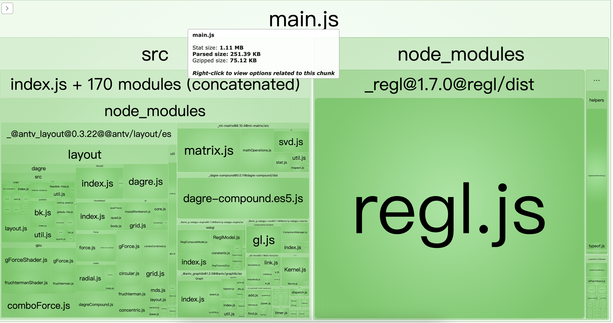
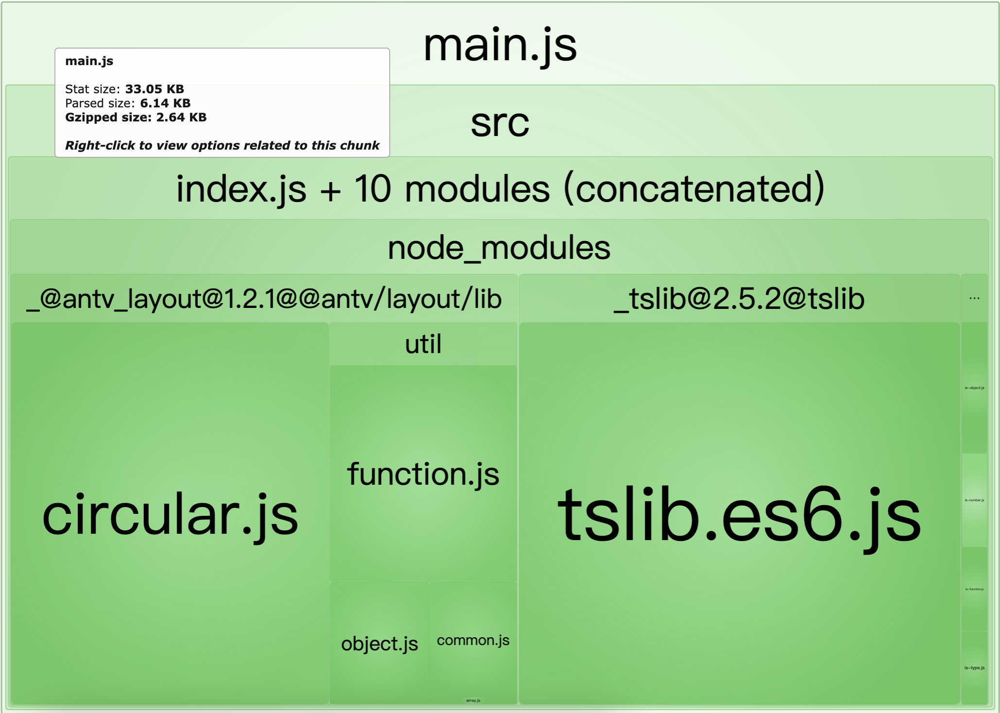

# Tree shaking in @antv/layout

If we only select one layout such as circular from `@antv/layout`, others especially those with bulky codes e.g. GPU layout should not be bundled.

```js
import { CircularLayout } from "@antv/layout";
const layout = new CircularLayout();
```

Compared with the legacy version(0.3.x), we support [tree shaking](https://webpack.js.org/guides/tree-shaking/) in `@antv/layout` now. Change the `version` from `0.3.22` to `1.2.1` in [package.json](./package.json), you can see the following bundle size comparison(75Kb -> 2.6Kb gzipped):




## How to run this demo

Run the following commands in the root directory.

```bash
npm install
npm run build
```

Go to `http://127.0.0.1:8888/` and you will see the treemap generated by [webpack-bundle-analyzer](https://www.npmjs.com/package/webpack-bundle-analyzer).
